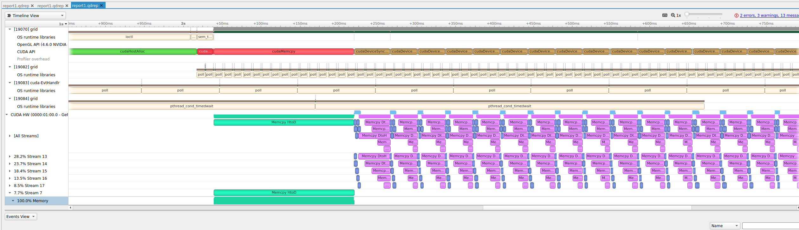

# **Conway's Game of Life (with CUDA)**

This repository contains a version of Conway's Game of Life which provides the option to either execute on the
CPU using a standard serialized approach, or on the GPU utilizing CUDA to parallelize the process. The purpose
of this project was to demonstrate how CUDA is capable of greatly increasing program performance and learn a
multitude of techniques along the way.

## How to Run
In order to run this you need to have the CUDA toolkit and SDL2 installed. At the time of finishing this project 
I am running v9.1 of their nvcc compiler.

Once you have cloned the repository, simply type ```$>make``` to compile (you may need to change the library path
for SDL2 if you don't have it in the default install location).

Once compiled, you can ```$>./grid``` to run the executable.
From this point you will be prompted to decide on whether you want to run the program slowly so you can watch it
execute, or just run a performance benchmark where it omits graphic rendering and just processes the data as fast
as possible.

If you select 'slow mode' you will input a delay (in miliseconds) between each frame. Once you have done that a
window will appear where you input the initial state of the world. Left click to select a sqare, right click on a
selected square to deselect it. Once you are satisfied with the initial state, press enter and sit back to watch it
run.

(at any point in time you can press ```esc``` or the 'x' at the top right of the window to close it)

When running the performance benchmark mode I recommend changing the grid width and height in the header file to
a large number in order to experience a more significant performance difference.

## Profiling the Execution
Nvidia has developed an incredible too called "nsight systems" which can be used to visually profile the execution
of the code. You can use the command ```$>make profile``` after compiling which will launch the program and create
a report of the execution after it finishes. This report can be viewed in nsight systems to help evaluate the program.



For example in this image I can see multiple kernels and memory transfers overlapping which confirms that I have
successfuly launched multiple GPU streams simutaneously in my program.
